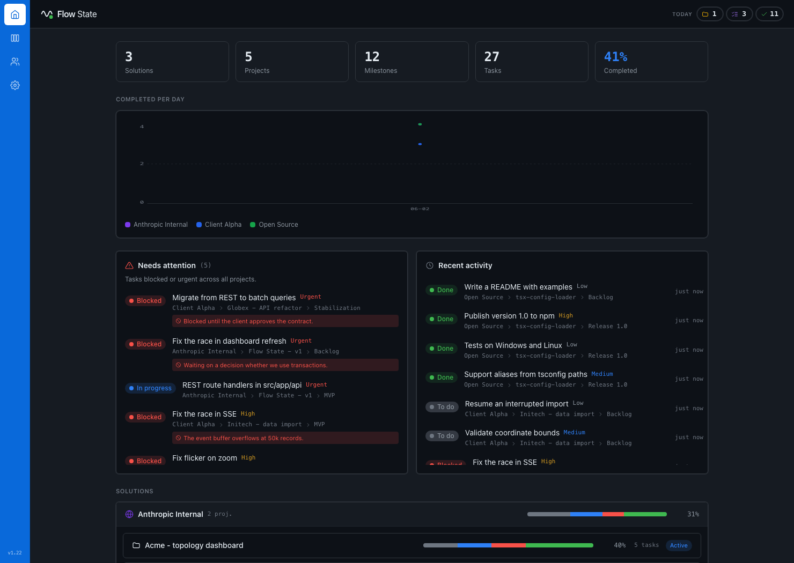

# Flow State

A living, shared source of truth for AI-agent + human project state. Instead of
scattered markdown (TODO.md, roadmaps) that drift out of date, Flow State keeps
the *current* state of work in one place that both people and Claude Code agents
read and write live.

Use it three ways, all backed by one local server: a live **web dashboard**, a
**native macOS menu-bar app** (SwiftUI, 1:1 with the web UI), and straight from
**Claude Code** via the `fs_` MCP tools.

## Screenshots



<!-- Maintainer/CI: add the real screenshot at docs/screenshot-dashboard.png (the
orchestrator captures one). -->

## What it is

- **Hierarchy:** Solution > Project > Milestone > Task > Comment.
- **Live dashboard:** a server-rendered UI that updates in real time over SSE -
  every mutation (from an agent or the UI) refreshes connected views. The SSR
  HTML is correct even without hydration (important for iOS Safari).
- **MCP tools:** agents use the `fs_` MCP tools (`fs_dashboard`,
  `fs_create_task`, `fs_list_tasks`, `fs_update_task`, `fs_changes_since`,
  `fs_whoami`, `fs_mint_agent_key`, ...) to track work instead of markdown files.
- **Gamified stats:** per-day completion counters (tasks / milestones / projects
  closed today) with a full-screen celebration on project/solution completion.
- **Local-first:** data lives in a local SQLite file via `node:sqlite`
  (synchronous). No external services required.

## Get started

**Requirements:** [Node](https://nodejs.org) **24+** (the store uses `node:sqlite`,
which is stable in Node 24) and **git**. On Node 22.12-23 it still works, but you
must enable the SQLite module with a flag (see the note below).

```bash
# 1. Get the source from GitHub
git clone https://github.com/NovaSeth/FlowState.git
cd FlowState

# 2. Install dependencies
npm install

# 3. Run it (the database data/fs.db is created automatically on first run)
npm run dev                       # dev server at http://localhost:3000
```

Then open <http://localhost:3000>. Want demo data to look around? Run
`npm run seed` first.

For phones / LAN (the dev server may not hydrate on iOS Safari) serve a
production build instead:

```bash
npm run build && npm run start
```

> **On Node 22.12-23**, prefix the run commands so `node:sqlite` is enabled, e.g.
> `NODE_OPTIONS=--experimental-sqlite npm run dev` (Node 24+ needs no flag).

### Environment

- `FS_API_KEY` - root/admin API key for bootstrap (e.g. minting the first agent
  key).
- `FS_AUTH` - set to `strict` to require a key for mutations.
- `FS_DB_PATH` - path to the SQLite database file. Defaults to `data/fs.db`.

### MCP and skill

The MCP server lives in this repo at `mcp/fs-mcp.mjs` (server id `flow-state`,
`fs_` tools, reads `FS_API_KEY`/`FS_BASE_URL`). See
[docs/MCP.md](docs/MCP.md) for how to register it with your Claude Code client.

To make Claude Code track work in Flow State instead of markdown:

```bash
claude mcp add flow-state -s user \
  -e FS_BASE_URL=http://localhost:3000 \
  -- node /ABSOLUTE/PATH/mcp/fs-mcp.mjs
```

Install the bundled skill (teaches the agent to use the `fs_` tools):

```bash
mkdir -p ~/.claude/skills/using-flow-state
cp skills/using-flow-state/SKILL.md ~/.claude/skills/using-flow-state/
```

## macOS menu-bar app

A native (Swift / AppKit + SwiftUI) menu-bar app (`macos/`) runs the server for
you and shows the dashboard as a **native SwiftUI window** - 1:1 with the web UI,
talking to the same local REST + SSE API (no web view). It starts the server at
login, shows live status via a wave icon (green running / gray stopped / amber
transitioning), and offers Start / Stop / Restart and Open Dashboard from its menu.

```bash
macos/install.sh   # builds FlowState.app, installs to /Applications, autostarts at login
```

See [macos/README.md](macos/README.md) for details.

> The macOS app is **optional**. The server is a normal Next.js app you can run on
> its own with `npm run start` (or `npm run dev`) - the menu-bar app just supervises
> that same server for you, and can attach to an already-running one with `--no-server`.

## Internationalization

The UI ships in English by default with a Polish translation. To add a language,
drop a JSON file in `src/i18n/` (mirror `en.json`, the source of truth, and
include a `language.self` key with the language's own native name) and register
it by adding one line to the `MESSAGES` registry in `src/i18n/index.ts`. The
Settings page then lists it automatically, by its native name. The active locale
is stored in the `fs_locale` cookie and seeded server-side so SSR text is correct
without hydration. Language is switched on the Settings page only.

## Security

By default the app runs in **open mode**: no API key is required, intended for a
trusted localhost / single-user setup. The dev and start servers bind all
interfaces (`0.0.0.0`), so the app is reachable on your LAN - this is
intentional so you can open the dashboard from your phone.

Auth is resolved per request (see `resolveContext` in `src/lib/http.ts`):

- **Open mode (default):** mutations are allowed without a key unless an admin
  key is set or strict mode is on. GET endpoints are **not** authenticated in
  open mode.
- **Require auth on mutations:** set an admin key via `FS_API_KEY` and/or
  `FS_AUTH=strict`. Mutations then require an `x-api-key` header. Mint per-agent
  keys (format `fsk_<prefix>.<secret>`, where the secret is shown only once at
  creation) via the `fs_mint_agent_key` MCP tool or `POST /api/keys`, and manage
  them in the `/users` UI.

Because GET endpoints are unauthenticated in open mode, **do not expose the
open-mode server to untrusted networks**. For LAN/shared/public hosting, set an
admin key and/or `FS_AUTH=strict`.

## License

MIT, see [LICENSE](LICENSE).

## Notes

This runs on **stock Next.js 16** from npm (not a fork or a patched build). Next
16 is a recent major that may be newer than your tools' training data, and it
ships its own docs at `node_modules/next/dist/docs/`. Read the relevant guide
there before making framework-level changes, and heed deprecation notices (see
`AGENTS.md`).

Stack: Next.js 16, React 19, TypeScript, Tailwind v4 (`@theme` in
`src/app/globals.css`), `node:sqlite`, Vitest, ESLint (`--max-warnings 0`).
